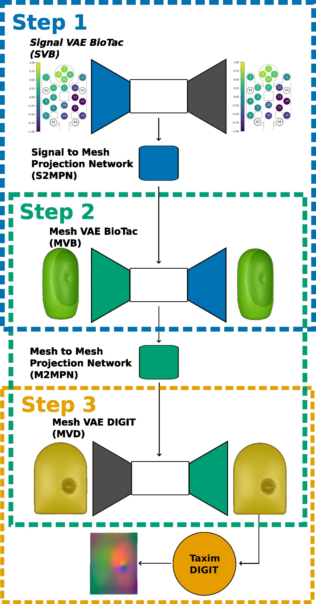
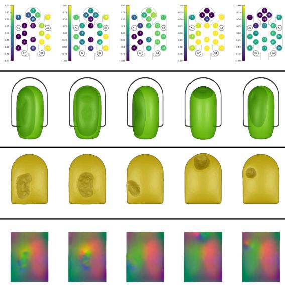

Accepted to 2025 IEEE Conference on Robotics and Automation (ICRA 2025)

Authors: Wadhah Zai El Amri, Malte Kuhlmann, Nicolás Navarro-Guerrero.

Topics: BioTac, DIGIT, Tactile sensors, Transfer learning.

# Abstract: 

Tactile perception is essential for human interaction with the environment and is becoming increasingly crucial in robotics. Tactile sensors like the BioTac mimic human fingertips and provide detailed interaction data. Despite its utility in applications like slip detection and object identification, this sensor is now deprecated, making many existing valuable datasets obsolete. However, recreating similar datasets with newer sensor technologies is both tedious and time-consuming. Therefore, it is crucial to adapt these existing datasets for use with new setups and modalities. In response, we introduce ACROSS, a novel framework for translating data between tactile sensors by exploiting sensor deformation information. We demonstrate the approach by translating BioTac signals into the DIGIT sensor. Our framework consists of first converting the input signals into 3D deformation meshes. We then transition from the 3D deformation mesh of one sensor to the mesh of another, and finally convert the generated 3D deformation mesh into the corresponding output space. We demonstrate our approach to the most challenging problem of going from a low-dimensional tactile representation to a high-dimensional one. In particular, we transfer the tactile signals of a BioTac sensor to DIGIT tactile images. Our approach enables the continued use of valuable datasets and the exchange of data between groups with different setups.

___________________________________________________________________

# Pipeline:

  

The figure above outlines the three steps of our pipeline:

### Step 1:

We first predict the BioTac surface deformation based on the input signals from the BioTac sensor.

### Step 2:

Next, we translate the BioTac surface mesh deformation to the DIGIT sensor's surface mesh deformation. This is possible because the physical interaction between both sensors can be modeled through mesh deformation, regardless of their different sensor output modalities.

### Step III: 

Finally, we generate the DIGIT sensor image from the transformed deformation.

The pipeline delivers results similar to the image below (Further results from the test set can be checked in the video below):

  

___________________________________________________________________

## Demonstration Video:

The following video demonstrates the pipeline in action, showing the BioTac sensor’s outputs (signals) and the corresponding generated DIGIT sensor images.

  

___________________________________________________________________

## Preprint: 

Our paper preprint is published on arXiv.

[Download paper here](http://wzaielamri.github.io/files/across_zaielamri.pdf)

## Code: 

Our code will be published soon, along with all necessary checkpoints and a detailed installation guide.

## Dataset:

Our dataset will be published soon. It includes over 155K unique 3D mesh deformation pairs from interactions involving BioTac and DIGIT sensors. The dataset covers various types of indenters, the forces applied to each sensor.

