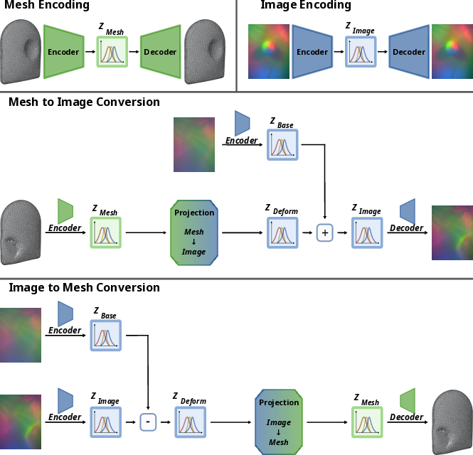
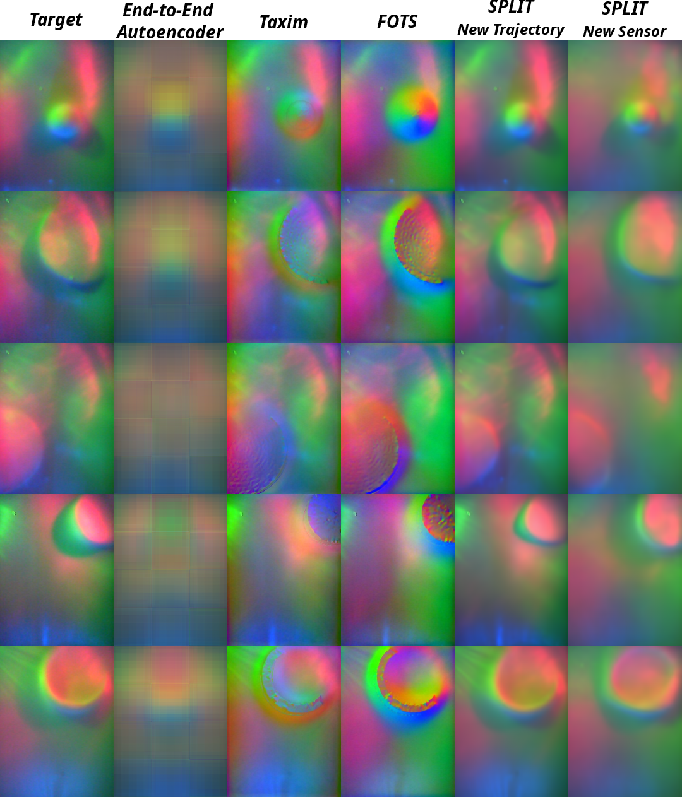

Accepted to Elsevier Robotics and Autonomous Systems Journal

Authors: Wadhah Zai El Amri, Nicolás Navarro-Guerrero.

Tactile Sensing, Real2Sim, Robotic Perception, Image-Based Tactile Sensors.

# Abstract: 

Training machine learning models for robotic tactile sensing requires vast amounts of data, yet obtaining realistic interaction data remains a challenge due to physical complexity and variability. Simulating tactile sensors is thus a crucial step in accelerating progress. This paper presents SPLIT, a novel method for simulating image-based tactile sensors, with a primary focus on the DIGIT sensor. Central to our approach is a latent space arithmetic strategy that explicitly disentangles contact geometry from sensor-specific optical properties. Unlike methods that require recalibration for every new unit, this disentanglement allows SPLIT to adapt to diverse DIGIT backgrounds and even transfer data to distinct sensors like the GelSight R1.5 without full model retraining. Beyond this adaptability, our approach achieves faster inference speeds than existing alternatives. Furthermore, we provide a calibrated finite element method (FEM) soft-body mesh simulation with variable resolution, offering a tunable trade-off between speed and fidelity. Additionally, our algorithm supports bidirectional simulation, allowing for both the generation of realistic images from deformation meshes and the reconstruction of meshes from tactile images. This versatility makes SPLIT a valuable tool for accelerating progress in robotic tactile sensing research.

---

## Overview
Training machine learning models for robotic tactile sensing requires massive amounts of data, but collecting real-world interaction data is physically complex and time-consuming. While simulation is a crucial workaround, existing methods often require tedious recalibration for every new sensor unit. 

**SPLIT** is a novel simulation framework designed primarily for image-based tactile sensors like the DIGIT. By leveraging a latent space arithmetic strategy, SPLIT explicitly disentangles the physical contact geometry of an interaction from the sensor's specific optical properties. This allows the framework to generate highly realistic tactile images, adapt to diverse sensor backgrounds, and transfer data across distinct hardware, without needing to retrain the model.

<p align="center">
___________________________________________________________________
</p>

## Key Features & Contributions

* **Hardware Generalization:** SPLIT can synthesize outputs for completely unseen DIGIT units without manual calibration. It can even generalize across different sensor types, adapting data to the GelSight R1.5 from a single deformation source.
* **Bidirectional Simulation:** The framework is versatile. It can generate realistic tactile images from 3D deformation meshes, and conversely, reconstruct 3D deformation meshes from 2D tactile images.
* **Fast Inference:** SPLIT generates high-fidelity tactile images from low-resolution geometric inputs (just 6,103 vertices), achieving an approximate 9x speedup over state-of-the-art geometric baselines like Taxim and FOTS.
* **Downstream Utility:** The isolated latent representations are proven to be highly effective for real-world downstream tasks, such as robust 3-DoF force estimation on unseen sensors.
* **Open-Source Resources:** The project provides a massive real-world dataset (>1 million contact images), a calibrated Isaac Gym soft-body FEM simulation, and the full codebase.

<p align="center">
___________________________________________________________________
</p>

## How It Works: The SPLIT Pipeline

SPLIT achieves this flexibility through a combination of cross-modal projection and latent space disentanglement.

<p align="center">
  
</p>

### 1. Modality Encoding
The pipeline trains two independent, disentangled Variational Autoencoders ($\beta$-VAEs). One learns compact, structured representations of 3D meshes ($Z_{Mesh}$), and the other learns representations of tactile images ($Z_{Image}$).

### 2. Cross-Modal Projection & Latent Arithmetic
To bridge the gap between 3D geometry and 2D optics, a multi-layer perceptron (MLP) maps the mesh representation ($Z_{Mesh}$) to a pure deformation space ($Z_{Deform}$). 

To teach the network to separate the physical touch from the sensor's lighting and background, SPLIT uses latent arithmetic during training: it subtracts the undeformed background vector ($Z_{Base}$) from the ground-truth image vector ($Z_{Image}$). This forces the network to learn *only* the pure deformation patterns invariant to optical characteristics.

### 3. Flexible Image Generation (Inference)
During inference, a highly realistic tactile image is reconstructed by simply predicting the deformation vector ($Z_{Deform}$) and adding a chosen background vector ($Z_{Base}$). By swapping the $Z_{Base}$ vector, you can simulate different DIGIT backgrounds or entirely different sensors.

<p align="center">
___________________________________________________________________
</p>

## Evaluation & Results

SPLIT was rigorously benchmarked against other state-of-the-art baselines (Taxim and FOTS).

* **Image Fidelity:** SPLIT consistently outperformed baselines across metrics like Mean Absolute Error ($l_{1}$), MSE, SSIM, and PSNR, successfully suppressing the jagged discretization artifacts seen in baseline methods when using low-resolution meshes.
* **Computational Efficiency:** By operating robustly on low-resolution meshes, SPLIT reduces the physics simulation overhead drastically. It achieves a total inference time of just **0.126 seconds per frame** running entirely on a CPU.
* **3D Mesh Reconstruction:** In its reverse pipeline, SPLIT achieved the lowest geometric reconstruction error, significantly outperforming baseline direct mapping methods.
* **Force Estimation:** By explicitly filtering out hardware-specific optical noise (like unique lighting gradients), SPLIT enables highly accurate normal and shear force estimation on completely unseen sensors where raw image methods typically fail.


<p align="center">
  
</p>


<p align="center">
___________________________________________________________________
</p>

## Demonstration Videos:

The following video shows the UR5e robot arm equipped with a DIGIT sensor collecting real-time tactile data. 

<p align="center">
  <a href="../images/split/data_collection.mkv">
    
  </a>
</p>


<p align="center">
___________________________________________________________________
</p>


This video demonstrates real-time inference using the SPLIT framework. The live input image is first encoded into the image latent space ($Z_{Image}$). To generate the multi-sensor outputs (bottom row), the reference background vector ($Z_{Base}$) is subtracted to isolate the pure deformation representation ($Z_{Deform}$), which is then combined with various target background vectors to synthesize the contact on different sensor units. Simultaneously, the system recovers the 3D geometry (top left) by mapping the image representation to the mesh latent space ($Z_{Mesh}$) via the reverse projection network and reconstructing the surface using the Mesh $beta$-VAE decoder.

<p align="center">
  <a href="../images/split/touch.mkv">
    
  </a>
</p>


---

## Appendix: 

You can find the paper appendix, which includes additional details and results, in the link below.

[Download paper here](http://wzaielamri.github.io/files/split_zaielamri_appendix.pdf)


## Preprint: 

Our paper preprint is published on arXiv.

[](https://arxiv.org/abs/todo)

[Download paper here](http://wzaielamri.github.io/files/split_zaielamri.pdf)

## Code: 

Our code is published online, along with all necessary checkpoints and a detailed installation guide.

[](https://github.com/wzaielamri/split_framework)

## Dataset:

Our dataset will be available soon upon request.

[](https://huggingface.co/datasets/wzaielamri/split_framework)

## Citation

```bibtex
@article{ZaiElAmri2026SPLIT,
  author = {Zai El Amri, Wadhah and {Navarro-Guerrero}, Nicol{\'a}s},
  title = {"SPLIT: Separating Physical-Contact via Latent Arithmetic in Image-Based Tactile Sensors"},
  journal = {Robotics and Autonomous Systems},
  year={2026},
}
```