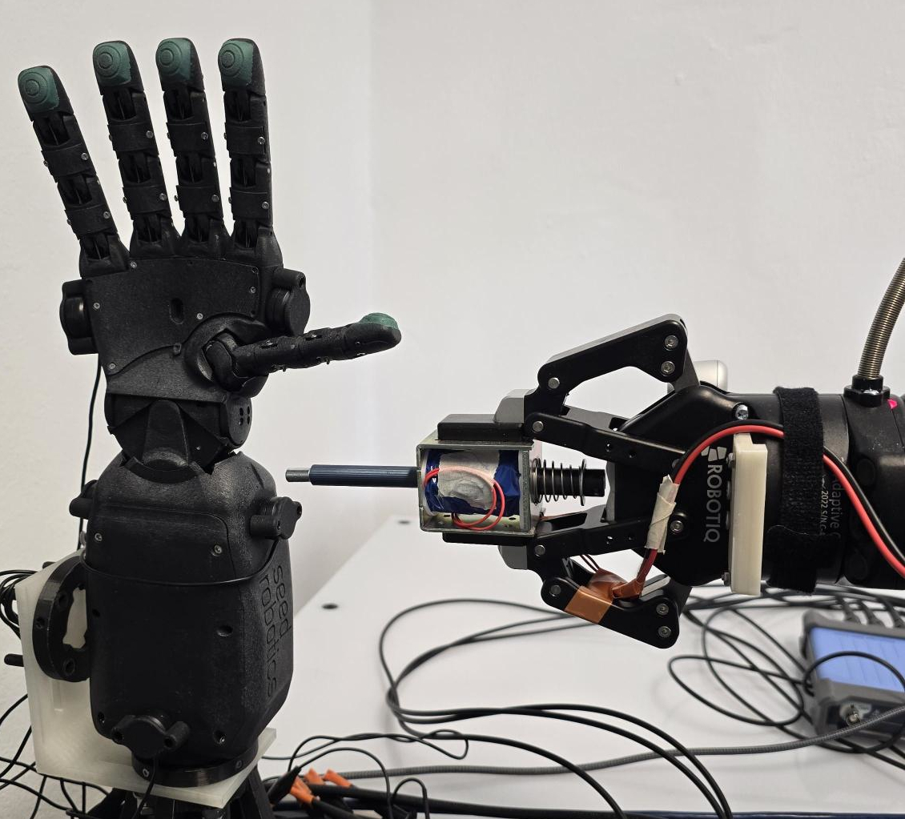

Submitted to Elsevier Robotics and Autonomous Systems Journal

Authors: Wadhah Zai El Amri, Nicolás Navarro-Guerrero.

Topics: Tactile Sensing, Vibro-Acoustic Sensing, Contact Localization, Deep Learning.

## Abstract: 

Rich contact perception is crucial for robotic manipulation, yet traditional tactile skins remain expensive and complex to integrate. This paper presents a scalable alternative: high-accuracy whole-hand touch localization via vibro-acoustic sensing. By equipping a robotic hand with seven low-cost piezoelectric microphones and leveraging an Audio Spectrogram Transformer, we decode the vibrational signatures generated during physical interaction. Extensive evaluation across stationary and dynamic tasks reveals an average localization error below 5 mm in static conditions. Furthermore, our analysis highlights the distinct influence of material properties: stiff materials (e.g., metal) excel in impulse response localization due to sharp, high-bandwidth responses, whereas textured materials (e.g., wood) provide superior friction-based features for trajectory tracking. The system demonstrates robustness to the robot's own motion, maintaining effective tracking even during active operation. Trained with additional no-contact recordings of the moving hand, the model further distinguishes genuine external contacts from internal motor and structural vibrations, reaching a detection accuracy of 99.0% with a false-positive rate of 0.2%. Our focus is on contact perception, enabling a robot to sense interactions with its surroundings. Our primary contribution is demonstrating that complex physical contact dynamics can be effectively decoded from simple vibrational signals, offering a viable pathway to widespread, affordable contact perception in robotics. To accelerate research, we provide our full datasets, models, and experimental setups as open-source resources.

<p align="center">
___________________________________________________________________
</p>

## Experimental Setup:

The following image illustrates our experimental setup, showcasing the robotic hand equipped with piezoelectric microphones used for the first task (impulse response localization):

<p align="center">
    
</p>


<p align="center">
___________________________________________________________________
</p>


## Demonstration Video:

Impulse localisation. The network predicts the contact location on the hand from the vibro-acoustic signal. Here the hand is stationary but its motor is running, so the prediction is made under continuous environmental noise.

<p align="center">
  <video src="../assets/images/vibrosense/localisation.mp4" width="320" style="max-width:100%;height:auto" autoplay loop muted playsinline controls></video>
</p>


Trajectory tracking under motion. Two heads run together: a contact head detects contact vs. no-contact, and a position head tracks the (X, Y) location of the moving contact point. This runs while the hand itself is in motion.

<p align="center">
  <video src="../assets/images/vibrosense/trajectory_target.mp4" width="320" style="max-width:100%;height:auto" autoplay loop muted playsinline controls></video>
</p>


Data collection. The automated procedure used to record the trajectory-tracking dataset.

<p align="center">
  <video src="../assets/images/vibrosense/video.mp4" width="960" style="max-width:100%;height:auto" autoplay loop muted playsinline controls></video>
</p>

<p align="center">
___________________________________________________________________
</p>


## Preprint: 

Our paper preprint is published on arXiv.

[](https://arxiv.org/abs/2601.20555)

[Download paper here](/assets/paper_files/vibrosense_zaielamri.pdf)

## Code: 

Our code is available on GitHub, including data processing scripts, model training code, and evaluation pipelines.

[](https://github.com/wzaielamri/vibrosense)

## Dataset:

Our dataset is available on Hugging Face, along with detailed documentation.

[](https://huggingface.co/datasets/wzaielamri/vibrosense)

## Citation


```bibtex
@Misc{ZaiElAmri2026VibroSense,
  author = {{Zai El Amri}, Wadhah and {Navarro-Guerrero}, Nicol{\'a}s},
  title  = {Vibro-Sense: Robust Vibration-based Impulse Response Localization and Trajectory Tracking for Robotic Hands},
  year   = {2026},
  eprint = {2601.20555},
  archivePrefix = {arXiv},
  primaryClass  = {cs.RO},
  note   = {Submitted to Robotics and Autonomous Systems},
}
```
